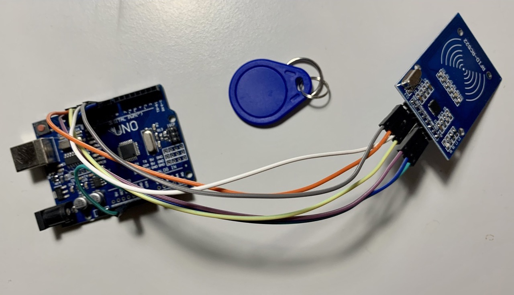

# RFID time tracking with Toggl and Chrome via Serial API

**Summary:** Starting and stopping Toggl timer with RFID tag using Serial API and Arduino.


<div style="margin: 3em 0"></div>

## Setup

**Required hardware**

- Arduino UNO or similar
- RFID-RC522,
- 7 jumper cables
- RFID card/tag

**Required software**

- Arduino IDE
- Chrome browser

<div style="margin: 3em 0"></div>

### HW and Code

Arduino logic is in the file _/rfid.ino_.
Compile and upload the _rfid.ino_ to an Arduino board.

Change `REGISTERED_CARD` to recognize your card. Check [this](https://randomnerdtutorials.com/security-access-using-mfrc522-rfid-reader-with-arduino/)  if you don't know the ID.

| Pin  | Connect to an Arduino |
|:-----|:----------------------|
| VCC  | 13 |
| RST  | 12 |
| GND  | 4 |
| IRQ  | NOT_CONNECTED |
| MISO | 10 |
| MOSI | 9 |
| SCK  | 8 |
| SDA  | 7 |


Change variables in _serial.html_ to your configuration.

```js
const WORSPACE_ID = -1
const API_KEY = '<API_KEY>'
```
